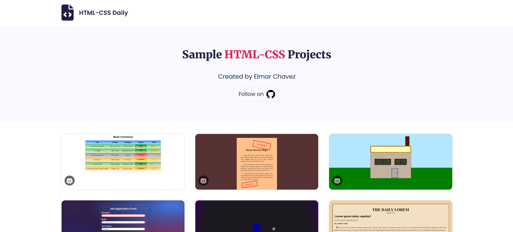

# 📁 Sample Projects Showcase

## ℹ️ Personal Project Gallery Built with HTML and CSS

A simple, responsive showcase of my early frontend projects using HTML5 and CSS3. Designed with accessibility and semantic structure in mind, this layout serves as my live gallery and entry point to each individual project.

---

## 🔍 Overview

This website is a personal portfolio hub that displays multiple beginner-level HTML5 and CSS3 projects. Each project is represented by a preview image and hover-reveal title. The layout is responsive, uses semantic HTML, and follows mobile-first design principles.

I built this during my learning path following the [freeCodeCamp.org](https://www.freecodecamp.org/) **Responsive Web Design Certification** course and extended it with my own custom styling, accessibility features, and layout system.

---

## ✨ Features

- Responsive grid layout for all screen sizes
- Semantic HTML structure with proper use of headings, `section`, and `footer`
- Custom CSS variables for theming and easy maintenance
- Animated hover effects for project cards
- Focus-visible states for keyboard accessibility
- Media queries to adapt grid layout (1, 2, 3 columns)

---

## 📚 Included Projects

This collection contains **19** individual HTML-CSS mini projects built while completing [freeCodeCamp.org's CSS course](https://www.freecodecamp.org/learn/full-stack-developer/):

1. [**Book Inventory App**](./Build%20a%20Book%20Inventory%20App) – A semantic layout simulating an inventory page for books.
2. [**Confidential Email Page**](./Build%20a%20Confidential%20Email%20Page) – A secure-themed email layout using visual emphasis and spacing.
3. [**House Painting Page**](./Build%20a%20House%20Painting%20Page) – A simple page of a house painting generated from CSS.
4. [**Job Application Form**](./Build%20a%20Job%20Application%20Form) – A styled and accessible job application form showcasing various input types.
5. [**Moon Orbit Page**](./Build%20a%20Moon%20Orbit%20Page) – A visual demonstration of a moon orbit revolving using CSS layout.
6. [**Newspaper Article**](./Build%20a%20Newspaper%20Article) – A classic newspaper layout using typography and multicolumn formatting.
7. [**Playing Cards Page**](./Build%20a%20Set%20of%20Playing%20Cards) – A card-based layout using grid display.
8. [**Personal Portfolio**](./Build%20a%20Personal%20Portfolio%20Webpage) – A basic portfolio landing page with semantic layout and CTA elements.
9. [**Product Landing Page**](./Build%20a%20Product%20Landing%20Page) – A landing page mockup for a tech product.
10. [**Stylized To-Do List**](./Build%20a%20Stylized%20To-Do%20List) – A visually enhanced to-do list interface using styled lists.
11. [**Technical Documentation Page**](./Build%20a%20Technical%20Documentation%20Page) – A documentation-style page with a sidebar and sections.
12. [**Tribute Page**](./Build%20a%20Tribute%20Page) – A tribute-style page focused on layout and content flow.
13. [**Availability Table**](./Build%20an%20Availability%20Table) – A structured table layout for showcasing schedules or availability.
14. [**Event Flyer Page**](./Build%20an%20Event%20Flyer%20Page) – A flyer-style design focused on event promotion and design hierarchy.
15. [**Blog Post Card**](./Design%20a%20Blog%20Post%20Card) – A card component design for blog post previews.
16. [**Business Card**](./Design%20a%20Business%20Card) – A digital mockup of a business card layout with styled elements.
17. [**Contact Form**](./Design%20a%20Contact%20Form) – A simple but styled form layout for gathering user contact inputs.
18. [**Magazine Layout Page**](./Design%20a%20Magazine%20Layout) – A creative magazine-style layout using advanced positioning.
19. [**Set of Colored Boxes**](./Design%20a%20Set%20of%20Colored%20Boxes) – A layout showcasing colored boxes in a structured design grid.

---

## 🧠 What I Learned

- How to structure and plan a scalable CSS grid layout
- Managing and organizing projects in a visual portfolio format
- Implementing ARIA roles and focus states for better accessibility
- Creating smooth transitions and visual feedback with CSS only
- Responsive design with mobile-first breakpoints

---

## 🛠️ Tech Used

- HTML5
- CSS3
- VS Code
- Git & GitHub
- Netlify

---

## 🚀 How to Run

1. Clone the repository
2. Navigate to this project folder
3. Open `index.html` in your browser

---

## 🌐 Live Demo

Or you can check out the 👉 [live website here](https://html-css-daily.netlify.app/)

---

## 🧑‍💻 Author

Created by **Elmar Chavez**

🗓️ Month/Year: **May 2025**

📚 Journey: **2nd** month of learning _frontend web development_.
